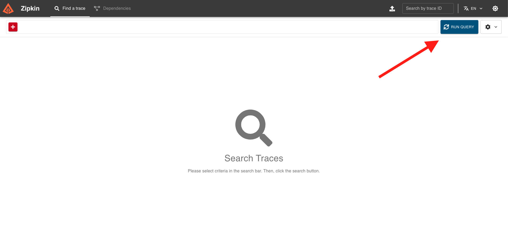
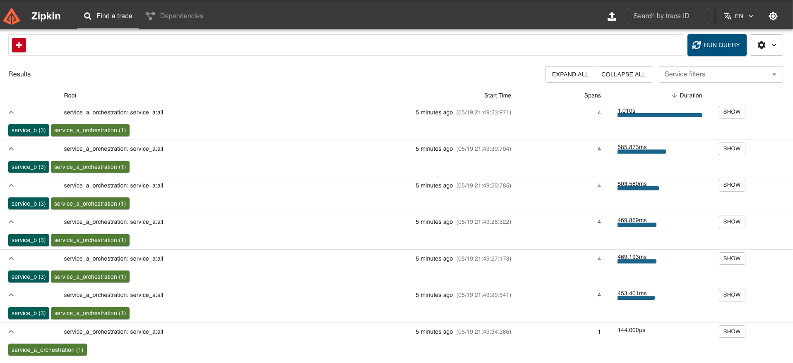
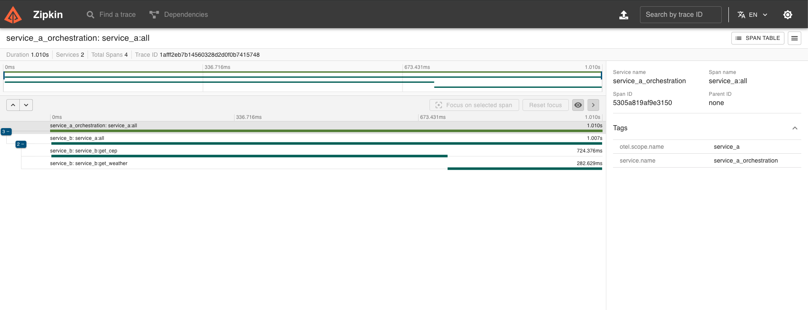

# Desafio FullCycle distributed trace
Este projeto é um desafio do curso FullCycle, onde o objetivo é criar um sistema distribuido que seja possivel visualizar o trace de uma requisição entre os microserviços.
## Tecnologias

- [Go](https://go.dev/)
- [Chi](https://go-chi.io/#/)
- [Zipkin](https://zipkin.io/) 
- [OpenTelemetry](https://opentelemetry.io/)
- [Docker](https://www.docker.com/)


## APIs usadas

Esse projeto usa as seguintes APIs:
- [Weather API](https://www.weatherapi.com)
- [ViaCEP](https://viacep.com.br)

Sendo que a API do weather necessita de uma chave para funcionar. Essa chave pode ser obtida assim que você se [cadastra](https://www.weatherapi.com/signup.aspx) na API do weather.
Com a chave em mãos, você pode adicionar ela no arquivo `env.json` na raiz do projeto no campo `api_key`.
É possivel usar a chave `6ec8b1eb5d064e83a5804852251305` para testar o projeto, mas não garantimos que a chave esteja válida no momento que você executar o projeto.


## Como executar localmente

- Execute o comando `docker compose up -d` para subir o container docker com o projeto.
- Após subir o container do docker, você pode executar a API usando `curl` abaixo:
```c
curl --location 'http://localhost:8080/temperature' \
--header 'Content-Type: application/json' \
--data '{
    "cep": "01310100"
}'
```
Resposta:
```json
{
    "city": "São Paulo",
    "temp_C": 18.9,
    "temp_F": 66.02,
    "temp_K": 291.9
}
```

## Como aceessar o Zipkin

- Acesse o Zipkin no endereço `http://localhost:9411` no navegador.
- Clique em `RUN QUERY`.


- Será exibido uma tela com os spans do projeto


- Clique em um span para ver os detalhes

